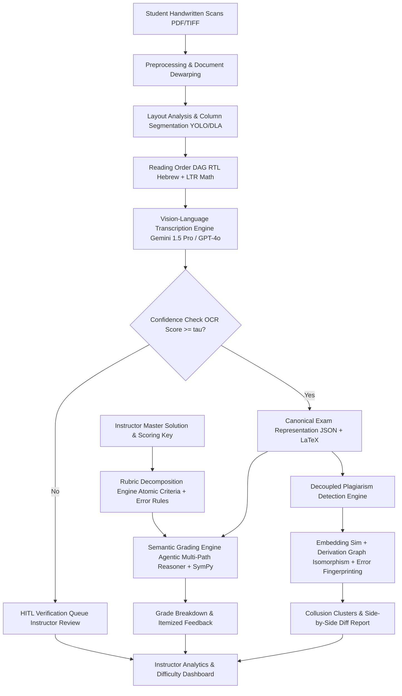
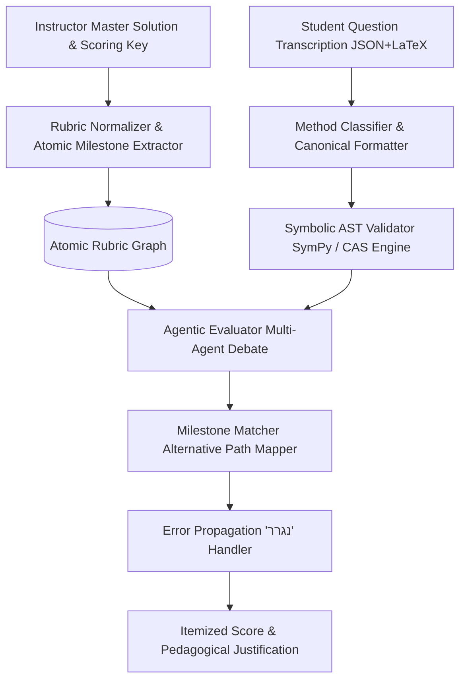
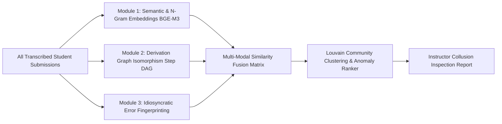
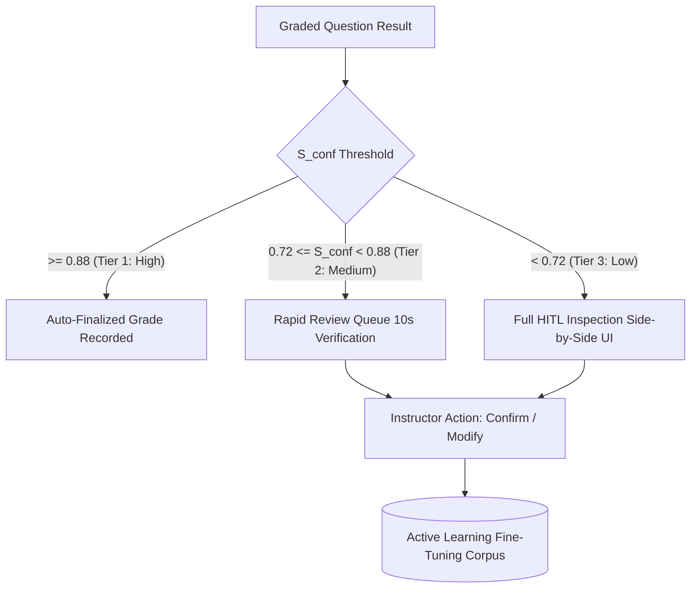

# Automated Exam Grading & Plagiarism Detection System
## System Architecture, Execution Plan & Master Checklist

---

## Executive Summary

The **Automated Exam Grading & Plagiarism Detection System** is an enterprise-grade AI solution designed to automate the intake, layout analysis, bilingual transcription (Hebrew text + LTR mathematical formulas), semantic grading with creative problem-solving diversity, independent cross-student plagiarism detection, and comprehensive instructor analytics.

---

## 1. Architectural Strategy & Model Selection

### 1.1 VLM & OCR Pipeline (Hebrew + Complex Math)

#### The Core Technical Challenge
Hebrew is a Right-to-Left (RTL) Semitic script, while mathematical formulas, equations, matrices, and variables ($x, y, f(x)$) are strictly Left-to-Right (LTR). In handwritten STEM exams:
- Students interleave Hebrew textual explanations with inline and block mathematical formulas.
- Traditional OCR engines (Tesseract, EasyOCR, ABBYY FineReader) treat text blocks with a single reading direction and lack LaTeX semantic understanding for handwritten fractions, integrals, and superscripts.
- Specialized math OCR tools (Mathpix, Nougat) are strictly English/LTR-oriented and fail on Hebrew script, often transliterating Hebrew characters into broken Cyrillic or Greek symbols.

#### Model Evaluation Matrix

| Criterion | Google Gemini 1.5 Pro | OpenAI GPT-4o | Anthropic Claude 3.5 Sonnet | Specialized OCR Hybrid (YOLO + TrOCR/DocTR + Mathpix) |
| :--- | :--- | :--- | :--- | :--- |
| **Handwritten Hebrew Recognition** | **Exceptional** (High accuracy on cursive/script Hebrew; robust to vowel points and ligature variations) | **Strong** (Good on standard handwriting; occasionally confuses visually similar letters like ו/ז/י, ח/ת/ה) | **Moderate-High** (Reliable on printed Hebrew, slightly higher error rate on rapid cursive Hebrew) | **Poor to Moderate** (Requires separate fine-tuned Hebrew TrOCR model; brittle at boundaries) |
| **Complex Math / LaTeX Formatting** | **Exceptional** (Generates syntactically valid LaTeX, matrix notation, inline and multiline alignments) | **Exceptional** (Strong LaTeX fidelity, clean symbol transcription) | **Exceptional** (Highest benchmark scores on math reasoning and diagrams) | **High** (Mathpix is industry standard for math, but breaks when mixed with Hebrew) |
| **Bi-directional (RTL/LTR) Handling** | **Native** (Maintains proper context switching between Hebrew rationale and math derivations) | **Strong** (Occasional token reversal at immediate Hebrew-math boundaries) | **Strong** (Proper contextual separation) | **Critical Failure** (Requires manual text-line slicing and direction tagging) |
| **Multi-Column & Spatial Awareness** | **High** (Large 2M token context, preserves 2D visual coordinate grounding) | **High** (Strong visual grounding via bounding box prompts) | **Exceptional** (Pinpoint layout comprehension and spatial coordinates) | **Manual Pipeline Required** (Requires custom layout segmentation model) |
| **Cost & Throughput** | **Optimal** (High throughput, competitive batch pricing, large input window for entire exams) | **Moderate** (Higher cost per page, lower token window for bulk exams) | **Higher** (Higher API cost for heavy vision tasks) | **High Maintenance** (Self-hosting, multi-model infrastructure overhead) |

#### Recommended Strategy: Tiered Hybrid Architecture
1. **Tier 1: Document Preprocessing & Layout Segmentation (Local Edge / GPU)**:
   - **Dewarping & Deskewing**: Page binarization and perspective correction via OpenCV and DocTR.
   - **Document Layout Analysis (DLA)**: YOLOv11-Doc / LayoutLMv3 fine-tuned on exam layouts to detect:
     - Question bounding boxes (e.g., "שאלה 1", "1.b").
     - Multi-column boundaries (left/right split lines or whitespace gutters).
     - Margin notes and continuation pointers ("המשך בעמוד הבא").
     - Strikethrough / crossed-out scribbles (to exclude discarded derivations from grading).
   - **Reading Order DAG (Directed Acyclic Graph)**: Reconstruct the logical reading order based on RTL conventions for Hebrew multi-column structures (Right column first $\to$ Left column second), while preserving LTR mathematical derivation flow within blocks.

2. **Tier 2: Primary VLM Transcription (Gemini 1.5 Pro / Flash)**:
   - Slice the exam by segmented Question Regions of Interest (ROIs).
   - Prompt the VLM with high-resolution image slices + system prompt enforcing strict bi-directional JSON output schema:
     - `hebrew_text`: Clean Hebrew transcript.
     - `math_latex`: Standard LaTeX equations for all mathematical expressions.
     - `raw_interleaved_markdown`: Native markdown with embedded `$...$` and `$$...$$` blocks.
     - `confidence_score`: Self-estimated transcription confidence per segment.
     - `ambiguities`: Array of flagged words/symbols where handwriting is illegible or indeterminate.

3. **Tier 3: Secondary Cross-Validation (GPT-4o)**:
   - Triggered when Gemini confidence is borderline ($0.70 \le C < 0.85$) or when mathematical syntax in LaTeX fails AST parsing (via KaTeX / SymPy).
   - Cross-verifies equation ASTs to eliminate transcription hallucinations.

---

### 1.2 Semantic & Flexible Grading Engine

#### The "Diversity of Solutions" Challenge
In academic STEM exams, a single problem may have 3–5 fundamentally different valid solution methods (e.g., solving an ODE using Laplace transforms vs. characteristic equations; physics problems solved via energy conservation vs. Newton's equations; proofs solved directly vs. by contradiction). Strict string matching or step-by-step keyword matching fails catastrophically.

#### Architecture of the Flexible Grading Engine

1. **Rubric Decomposition (Atomic Rubric Graph - ARG)**:
   - Convert the instructor's solution into an Atomic Rubric:
     - **Milestones**: Discrete conceptual goals (e.g., "Identified boundary condition $y(0)=0$ [2 pts]", "Correctly applied integration by parts [3 pts]", "Derived final expression [2 pts]").
     - **Equivalent Paths**: Pre-computed alternative paths (e.g., Path A: Direct Integration; Path B: Substitution $u = \tan(x/2)$).
     - **Negative Rubrics**: Specific penalty deductions for known misconceptions.
     - **Error Propagation Rules ("נגרר" / Consequential Error)**: If an arithmetic error occurs in Step 1 (e.g., $2 \times 3 = 5$, docking 1 pt), subsequent steps executed correctly based on the erroneous intermediate value $5$ receive **full conceptual credit**.

2. **Multi-Agent Evaluation Loop**:
   - **Agent 1: Mathematical Equivalence Checker (Symbolic + LLM)**:
     - Parses student mathematical steps into SymPy / CAS ASTs.
     - Computes algebraic simplification ($f_{student}(x) - f_{rubric}(x) \equiv 0$) to verify equivalent forms without penalizing unsimplified yet correct answers.
   - **Agent 2: Pedagogical Rubric Matcher**:
     - Maps the student's solution steps to the Atomic Rubric Milestones, irrespective of order or novel methodology.
   - **Agent 3: Adversarial Grading Auditor (Consistency & Fairness)**:
     - Validates that deductions match the point rubric, verifies that partial credit is equitable across the student cohort, and ensures Hebrew feedback is polite, constructive, and precise.

---

### 1.3 Independent Plagiarism & Collusion Detection Module

#### Decoupled Architecture
Plagiarism detection must run independently of individual grading to prevent bias. It is executed as a cohort-wide batch job after all exams for a specific test are digitized.

1. **Layer 1: Structural & Textual Semantic Similarity**:
   - Transcripts are embedded using multi-lingual dense vector models (e.g., `BAAI/bge-m3` or `text-embedding-3-large`).
   - Pairwise cosine similarity matrix computed across all student pairs per question.
   - Fast LSH (Locality Sensitive Hashing) / MinHash used for near-duplicate n-gram and sentence structure matching.

2. **Layer 2: Derivation Graph Isomorphism (Math Step Matching)**:
   - Each student's mathematical steps are parsed into a sequence of canonical equation representations.
   - Computes Graph Edit Distance (GED) and longest common subsequence (LCS) of mathematical operations.
   - Detects when two students use identical variable naming conventions or peculiar algebraic rearrangements that deviate from the master solution.

3. **Layer 3: Idiosyncratic Error & Artifact Fingerprinting (The "Smoking Gun")**:
   - Independent identical correct answers are normal. Independent identical **bizarre, non-standard errors** are statistical anomalies indicating copying.
   - Algorithmic anomaly detector isolates:
     - Identical wrong arithmetic operations (e.g., both wrote $7 \times 8 = 54$).
     - Identical non-standard variable names (e.g., using $\xi$ or an arbitrary substitution $k_7$).
     - Shared geometric drawing layout peculiarities.
   - Calculates a **Collusion Confidence Score** ($P_{copy} \in [0, 100\%]$) with mathematical justification for instructor review.

---

### 1.4 Confidence & Fallback Logic (Human-in-the-Loop - HITL)

The system computes an aggregate **Confidence Index** $S_{conf}$ for every question:

$$S_{conf} = w_1 C_{ocr} + w_2 C_{layout} + w_3 C_{eval} + w_4 C_{symbolic}$$

Where:
- $C_{ocr}$: VLM transcription token log-probabilities and legibility metrics.
- $C_{layout}$: Document segmentation stability (absence of overlapping blocks or ambiguous margin arrows).
- $C_{eval}$: Evaluation consensus score between grading agents.
- $C_{symbolic}$: Deterministic CAS proof verification score.

#### Dynamic Routing Tiers

- **Tier 1 (High Confidence $\ge 0.88$)**: Immediate automated grading, full feedback generated.
- **Tier 2 (Medium Confidence $0.72 - 0.87$)**: "One-Click Quick Verification". Displayed to the instructor with highlighted uncertainty points (e.g., "Confirm if student wrote $x_1$ or $x_2$").
- **Tier 3 (Low Confidence $< 0.72$)**: Full manual fallback. The original scan crop is shown side-by-side with the candidate transcription, and the instructor can either edit the text or grade directly.

---

## 2. Comprehensive Phased Execution Plan

### Phase 1: Architecture, Infrastructure & Data Preprocessing Pipeline
- **Core Objectives**: Establish secure, scalable cloud infrastructure, document intake pipeline, and image normalization microservice capable of handling raw, skewed, low-contrast, or mobile-scanned student exam papers.
- **Technical Deliverables**:
  - Cloud infrastructure (FastAPI backend, PostgreSQL with pgvector, Redis task queue, S3/GCS encrypted document storage).
  - Document Preprocessing Service: Auto-cropping, perspective correction, contrast enhancement (CLAHE), deskewing, and high-DPI scaling.
  - Anonymization engine: Automated redaction/masking of student identity headers before grading to eliminate evaluation bias.
- **Edge Cases & Risk Mitigation**:
  - *Edge Case*: Mobile phone camera photos with heavy shadows, perspective distortion, and uneven lighting.
  - *Mitigation*: OpenCV adaptive thresholding, homography-based perspective rectification using detected page borders.

### Phase 2: Multi-Column Layout Analysis & Bi-Directional Hebrew-Math VLM Transcription
- **Core Objectives**: Implement reliable layout parsing that disentangles multi-column student answers, handles Hebrew RTL text alongside LTR mathematics, and outputs structured canonical JSON with LaTeX representations.
- **Technical Deliverables**:
  - DLA module: Fine-tuned YOLOv11-Doc / LayoutLMv3 for bounding box detection of question numbers, sub-questions, answers, and strikethroughs.
  - Topological Reading Order Sorter: Graph algorithm reconstructing RTL column sequence while maintaining LTR formula blocks.
  - VLM Transcription Pipeline: Production prompts and client wrappers for Gemini 1.5 Pro / Flash with structured output schemas.
  - Fallback OCR verification pipeline for mathematical AST validation via KaTeX/SymPy.
- **Edge Cases & Risk Mitigation**:
  - *Edge Case*: Student splits a single page into 3 informal vertical columns and adds an arrow pointing from Column 3 back to the top of Column 1.
  - *Mitigation*: Arrow and visual flow-line detection in the layout model; explicit prompt instruction for the VLM to follow visual callout pointers.
  - *Edge Case*: Hebrew characters identical to mathematical symbols (e.g., Hebrew letter 'ח' vs mathematical symbol '$\sqcap$', or 'צ' vs '$y$').
  - *Mitigation*: Context-aware bi-directional language modeling; vocabulary constraint masks separating mathematical environments (`$...$`) from textual prose.

### Phase 3: Semantic Grading Engine, Rubric Decomposition & Symbolic Reasoning
- **Core Objectives**: Develop an automated grading engine that evaluates solutions against the instructor's key with full semantic flexibility for diverse, alternative, or creative problem-solving methods, complete with error propagation handling.
- **Technical Deliverables**:
  - Master Solution Ingestion Parser: Deconstructs the instructor's PDF/Word solution into an Atomic Rubric Graph (milestones, weights, alternatives, negative penalties).
  - Symbolic CAS Evaluation Engine (SymPy / Math Engine API) for algebraic equivalence checking.
  - Multi-Agent Grading Core (Method Classifier $\to$ Milestone Rubric Matcher $\to$ Error Propagation Auditor $\to$ Hebrew Feedback Generator).
  - Confidence scoring calculation engine ($S_{conf}$).
- **Edge Cases & Risk Mitigation**:
  - *Edge Case*: A student uses a valid, high-level university method (e.g., Green's Theorem) for a problem intended to be solved with basic line integrals.
  - *Mitigation*: The Symbolic Engine validates that the mathematical conclusions and boundary relations are sound; the grading agent checks if the syllabus explicitly forbade alternative theorems; if not prohibited, awards full credit.
  - *Edge Case*: Cascade/Error Propagation: An arithmetic slip in sub-step (a) changes numerical values for sub-steps (b) and (c).
  - *Mitigation*: Consequential Error ("נגרר") Rule Engine recalculates subsequent milestones using the student's erroneous intermediate value; if the derivation logic is 100% correct, full partial credit is awarded.

### Phase 4: Decoupled Plagiarism & Collusion Detection Engine
- **Core Objectives**: Build an independent batch analysis pipeline that detects copying, collusion, and unauthorized collaboration across student exam submissions.
- **Technical Deliverables**:
  - Pairwise similarity matrix generator using BGE-M3 embeddings.
  - Mathematical Derivation Graph Isomorphism detector.
  - Anomaly detection engine for shared idiosyncratic errors, identical arithmetic mistakes, and unique notation fingerprints.
  - Louvain community detection algorithm to cluster suspected collusion rings.
  - Instructor-facing Evidence Dossier: Side-by-side visual diffs highlighting identical lines and statistical probability metrics.
- **Edge Cases & Risk Mitigation**:
  - *Edge Case*: Two students both solve a standard problem using the single standard textbook proof, producing high similarity.
  - *Mitigation*: Exclude standard correct solution paths from anomaly scores; weight similarity heavily by *abnormal* variations, non-standard variable choices, and *shared incorrect steps*.

### Phase 5: Instructor Dashboard, HITL Review Interface & Analytics
- **Core Objectives**: Provide a responsive, modern web dashboard for instructors to review grades, inspect low-confidence scans, adjudicate flagged copying, and visualize aggregate exam analytics.
- **Technical Deliverables**:
  - Human-in-the-Loop (HITL) Verification Workbench: Split-screen UI showing original handwritten scan crops alongside transcribed LaTeX and suggested grades, with one-click adjustments.
  - Global Exam Analytics Engine:
    - Item Response Theory (IRT) difficulty and discrimination index calculation per question.
    - Common Misconception Clustering: Unsupervised grouping of errors to report "Where the class struggled" (e.g., "48% of students lost points in Q3 due to missing integration constant $+C$").
    - Grade distribution curves, standard deviation, and anomaly alerts.
  - Export system: LMS gradebook sync (Moodle, Canvas, Blackboard) and detailed PDF student grade reports in Hebrew.
- **Edge Cases & Risk Mitigation**:
  - *Edge Case*: Instructor overrides AI grades repeatedly for a specific question.
  - *Mitigation*: The system detects repeated manual adjustments, automatically prompts the instructor to update the Atomic Rubric, and re-evaluates the remaining cohort papers based on the revised criteria.

### Phase 6: System Integration, Security, Stress Testing & Deployment
- **Core Objectives**: End-to-end integration, performance profiling, security hardening (FERPA/GDPR compliance for student data), and production deployment.
- **Technical Deliverables**:
  - End-to-End automated testing suite (synthetic handwritten exam generator + historical exam benchmark dataset).
  - Asynchronous worker scaling (Celery/Temporal workers on Kubernetes with GPU autoscaling).
  - Security suite: End-to-end encryption at rest (AES-256) and in transit (TLS 1.3), student PII anonymization, audit logs.
  - Comprehensive documentation, deployment Helm charts, and instructor onboarding guides.
- **Edge Cases & Risk Mitigation**:
  - *Edge Case*: High-volume submission spike (e.g., 500 students submitting 8-page exams simultaneously after finals = 4,000 pages).
  - *Mitigation*: Decoupled async job architecture with Redis queue, rate-limited batching for VLM API endpoints, and prioritized queueing (fast OCR first, background plagiarism detection second).

---

## 3. Master To-Do Checklist

### Phase 1: Architecture, Infrastructure & Data Pipeline
- [ ] **Infrastructure & Environment Setup**
  - [ ] Initialize Git repository with monorepo structure (`/backend`, `/frontend`, `/ml-pipeline`, `/docs`)
  - [ ] Set up Docker & Docker Compose development environment
  - [ ] Configure PostgreSQL database with `pgvector` extension for embeddings
  - [ ] Deploy Redis instance for task queueing and caching
  - [ ] Set up S3-compatible encrypted object storage (MinIO / AWS S3) for raw scans
  - [ ] Establish CI/CD pipelines (GitHub Actions) with automated linting and unit tests
- [ ] **Document Intake & Preprocessing Microservice**
  - [ ] Implement multi-page PDF and multi-image TIFF/JPEG ingestion endpoint
  - [ ] Build automatic page dewarping and perspective rectification (OpenCV / DocTR)
  - [ ] Implement CLAHE adaptive contrast enhancement for light pencil / messy ink
  - [ ] Build auto-deskewing algorithm based on Hough transform and projection profiles
  - [ ] Implement automated student ID header detection and anonymization masking module
  - [ ] Create unit tests for image preprocessing under simulated bad lighting and rotation

---

### Phase 2: Layout Parsing & Bi-Directional Transcription (Hebrew + Math)
- [ ] **Multi-Column Document Layout Analysis (DLA)**
  - [ ] Assemble and label a benchmark dataset of multi-column handwritten Hebrew STEM exams
  - [ ] Train/Fine-tune YOLOv11-Doc / LayoutLMv3 for bounding box segmentation:
    - [ ] Question header labels ("שאלה", "סעיף")
    - [ ] Work blocks and multi-column divisions
    - [ ] Marginal notes and continuation annotations
    - [ ] Strikethrough and scratched-out scribble regions
  - [ ] Develop Topological Reading Order DAG algorithm (RTL column flow + LTR math blocks)
  - [ ] Implement polygon crop extraction with margin preservation
- [ ] **VLM Transcription Engine**
  - [ ] Configure API client integrations with retry/backoff for Gemini 1.5 Pro, GPT-4o, and Claude 3.5
  - [ ] Design structured bi-directional transcription prompts:
    - [ ] Output schema: `{ hebrew_text, math_latex, interleaved_md, confidence, flagged_tokens }`
    - [ ] Few-shot examples of mixed Hebrew handwriting and complex formulas (integrals, matrices, fractions)
  - [ ] Implement LaTeX AST validation using KaTeX / SymPy to detect broken mathematical syntax
  - [ ] Build dual-VLM cross-verification fallback mechanism for low-confidence text segments
  - [ ] Develop test suite benchmarking character error rate (CER) and math formula accuracy

---

### Phase 3: Semantic Grading Engine & Flexible Reasoning
- [ ] **Master Solution & Rubric Normalization**
  - [ ] Create instructor input parser for master solution PDF/LaTeX files
  - [ ] Implement LLM-powered Rubric Decomposition into Atomic Rubric Graph (ARG):
    - [ ] Milestone nodes with designated point allocations
    - [ ] Allowable alternative derivation paths
    - [ ] Consequential error ("נגרר") tracking rules
    - [ ] Negative penalty tags (common misconceptions)
  - [ ] Build instructor UI for reviewing and modifying generated atomic rubrics
- [ ] **Multi-Agent Evaluation Core**
  - [ ] Implement Method Classifier Agent to identify student's chosen problem-solving strategy
  - [ ] Integrate SymPy / Computer Algebra System (CAS) for exact symbolic equivalence checking
  - [ ] Build Milestone Matcher Agent for mapping student steps to atomic rubric criteria
  - [ ] Develop Error Propagation ("נגרר") Engine to preserve partial credit on downstream steps
  - [ ] Implement Adversarial Auditor Agent to check consistency and prevent hallucinated grades
  - [ ] Implement Hebrew Pedagogical Feedback Generator with concise, supportive error explanations
  - [ ] Build composite Confidence Calculation Engine ($S_{conf}$) combining OCR, layout, and evaluation scores

---

### Phase 4: Independent Plagiarism & Collusion Detection
- [ ] **Vector & Structural Similarity Pipeline**
  - [ ] Integrate multilingual dense embedding model (`BAAI/bge-m3` / `text-embedding-3-large`)
  - [ ] Build vector indexing and pairwise cosine similarity calculation per question
  - [ ] Implement MinHash/LSH near-duplicate n-gram string matcher
- [ ] **Mathematical Derivation Graph Isomorphism**
  - [ ] Build formula AST parser converting LaTeX sequences into derivation step graphs
  - [ ] Implement Graph Edit Distance (GED) and Longest Common Subsequence of math steps
  - [ ] Detect shared unique variable naming and unusual algebraic rearrangements
- [ ] **Idiosyncratic Error Fingerprinting & Clustering**
  - [ ] Build anomaly detector for shared non-standard incorrect calculations
  - [ ] Implement statistical anomaly scoring filter (distinguishing common slips from unique copies)
  - [ ] Implement Louvain community detection algorithm to group suspicious collusion clusters
  - [ ] Build automated Evidence Dossier generator with highlighted side-by-side visual diffs

---

### Phase 5: Instructor Dashboard & HITL Interface
- [ ] **Human-in-the-Loop (HITL) Review Workbench**
  - [ ] Build interactive split-screen review UI (original scan crop vs. transcription + grade)
  - [ ] Create rapid "One-Click Approve" interface for medium-confidence questions
  - [ ] Implement inline LaTeX editor and score adjustment controls for instructors
  - [ ] Implement audit trail logging all instructor overrides for active learning feedback
- [ ] **Analytics & Global Difficulty Dashboard**
  - [ ] Build question-level score distribution charts and box plots
  - [ ] Implement Item Response Theory (IRT) difficulty and discrimination parameter calculations
  - [ ] Develop Unsupervised Error Clustering for thematic "Global Difficulty" insights
  - [ ] Create Class Mastery Heatmap by curriculum topics and competencies
  - [ ] Build export connectors for LMS platforms (Moodle, Canvas) and student PDF scorecards

---

### Phase 6: System Integration, Security & Production Deployment
- [ ] **Testing & Quality Assurance**
  - [ ] Curate an end-to-end evaluation dataset of 200+ real handwritten exam pages with ground truth
  - [ ] Perform stress testing with simulated concurrent batch uploads of 5,000+ pages
  - [ ] Conduct adversarial testing (illegible handwriting, upside-down pages, multiple languages)
- [ ] **Security, Privacy & Compliance**
  - [ ] Ensure strict PII redaction and FERPA/GDPR student privacy compliance
  - [ ] Implement role-based access control (RBAC) (Lead Instructor, Teaching Assistant, Auditor)
  - [ ] Configure full disk encryption (AES-256) and TLS 1.3 transit encryption
- [ ] **Deployment & Operations**
  - [ ] Containerize services with Docker and write Kubernetes (EKS/GKE) manifests
  - [ ] Configure Prometheus metrics collection and Grafana monitoring dashboards
  - [ ] Set up automated backup and disaster recovery procedures for exam storage
  - [ ] Deliver user documentation, instructor quick-start guide, and API documentation

---

## 4. Key Open Decisions & Architectural Questions

1. **VLM API vs. Private Self-Hosted Models**:
   - *Option A (Recommended for Accuracy)*: Cloud Frontier APIs (Gemini 1.5 Pro / GPT-4o). Highest accuracy on Hebrew handwriting + math; zero infrastructure maintenance; enterprise zero-data-retention agreements.
   - *Option B (Recommended for Strict On-Prem Air-Gapped Compliance)*: Self-hosted fine-tuned open-weights models (e.g. Qwen2-VL-72B or hybrid TrOCR + Llama-3.3-70B on local GPU clusters). Requires significant GPU resources (multi-A100/H100) and upfront fine-tuning.
2. **LMS Integration Depth**:
   - Should the initial release focus on standalone CSV/Excel export or direct bidirectional LTI 1.3 / REST integration with Moodle and Canvas?
3. **Instructor Feedback Language**:
   - Confirm whether student feedback should be generated strictly in Hebrew, or if English/bilingual options are required for international or English-medium degree programs.
