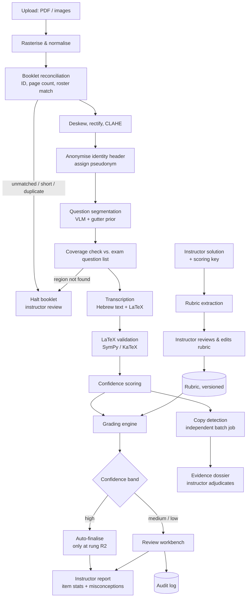

# Technical Architecture

Companion to [`IMPLEMENTATION_PLAN.md`](../IMPLEMENTATION_PLAN.md). That document defines *what* is built, in what order, and the measurable gate each phase must pass. This one defines *how* the system is put together.

---

## 1. Pipeline



Two structural properties are deliberate. **Anonymisation precedes every external call**, which serves privacy and removes identity bias from grading. **Copy detection branches off the transcripts, not the grades**, so it cannot be influenced by them — the independence the brief requires.

---

## 2. Components

| Module | Responsibility |
| :--- | :--- |
| `backend/intake/` | Upload, PDF rasterisation, booklet reconciliation against roster |
| `backend/preprocessing/` | Deskew, perspective rectification, CLAHE, identity anonymisation |
| `backend/layout/` | Question segmentation, gutter detection, reading order, strikethrough exclusion |
| `backend/transcription/` | VLM clients, prompt templates, LaTeX validation, cross-model check |
| `backend/grading/` | Rubric extraction, milestone matching, symbolic equivalence, consequential error |
| `backend/confidence/` | Signal aggregation, calibration, band routing |
| `backend/plagiarism/` | Embeddings, derivation graphs, anomaly fingerprinting, dossier generation |
| `backend/analytics/` | Item statistics, misconception clustering, report rendering |
| `backend/api/` | FastAPI routes, job queue, review workbench endpoints |
| `frontend/` | Jinja2 + HTMX templates, KaTeX rendering |

---

## 3. Model selection

### 3.1 The Hebrew-plus-mathematics problem

Three distinct difficulties, which is why general OCR fails here:

1. **Bidirectional context switching.** Hebrew prose runs right-to-left while mathematics runs left-to-right, and students interleave them freely, often mid-sentence. Conventional OCR assigns one direction per text block and scrambles the boundaries.
2. **Visual ambiguity across scripts.** Handwritten Hebrew letters collide with mathematical symbols — ז against `z` or `7`, ו against `1`, ח against `∩`, ס against `σ`. Disambiguation requires knowing whether the surrounding region is prose or mathematics.
3. **Two-dimensional notation.** Fractions, matrices, exponents, and summation limits encode meaning in spatial arrangement, which line-oriented recognition discards.

Specialised mathematics OCR (Mathpix, Nougat) handles (3) well but is built for Latin script and mangles Hebrew. Hebrew OCR handles prose but not notation. A vision-language model with genuine spatial grounding is the only approach that addresses all three in one pass — which is the hypothesis Phase 0 exists to verify rather than assume.

### 3.2 Candidates

Phase 0 decides this empirically on real pages. The table below is the starting shortlist and the reasoning behind each entry — **not a result**, and the prior plan's confident capability ratings were removed precisely because nothing had measured them.

| Candidate | Role | Why shortlisted |
| :--- | :--- | :--- |
| `gemini-3.1-pro-preview` | Primary | Strongest spatial and multimodal reasoning; large context permits whole-page layout reasoning |
| `gemini-3.5-flash` | Volume tier | Materially cheaper; adequate for legible pages, with escalation on low confidence |
| `gpt-5.6-sol` | Cross-check | Independent architecture and training data, so disagreement is informative |
| Tesseract-Hebrew / DocTR | Baseline | Quantifies what the VLM actually buys; without a baseline the comparison has no floor |

Retired or retiring, and therefore unusable: `gemini-1.5-pro` and `gemini-1.5-flash` (shut down 29 Sep 2025), `gemini-2.0-flash` (1 Jun 2026), `gemini-2.5-pro` (16 Oct 2026), `gpt-4o` dated snapshots (23 Oct 2026).

### 3.3 Version discipline

Pin exact version IDs. Never use `gemini-pro-latest` or `gemini-flash-latest`: they re-point without notice, and a re-point midway through grading a cohort means some students were graded by a different model than others. That is indefensible on appeal. Freeze the model version for the duration of a cohort's grading and record it on every stored grade.

---

## 4. Layout and multi-column handling

The decisive simplification: **grading is per-question, so question-level segmentation is what matters, not a globally correct page reading order.** This turns the brief's second stated difficulty from a research problem into an engineering one and removes the need for a fine-tuned layout model — which would have required a labelled corpus of multi-column handwritten Hebrew exams that does not exist.

**Approach, cheapest first:**

1. **Gutter prior (OpenCV).** Vertical projection profile of ink density across the page; sustained low-density troughs indicate column boundaries. Deterministic, fast, and free.
2. **VLM segmentation.** Full page plus the gutter prior, requesting question and sub-question regions with their reading order and any continuation pointers.
3. **Coverage validation.** Compare detected question IDs against the question list parsed from the instructor's exam.

Step 3 is the safety mechanism, and it exists because of a specific bug class. Three states must stay distinct:

| State | Meaning | Action |
| :--- | :--- | :--- |
| Answered | Region found with content | Grade it |
| Blank | Region found, deliberately empty | Legitimate zero |
| **Not found** | System could not locate the region | **Halt and escalate — never zero** |

Conflating *not found* with *blank* silently awards zero for work the student actually did. No accuracy metric downstream detects this, because from the grader's perspective the answer simply was not there.

Within a question, reading order follows right-to-left column progression for Hebrew prose while preserving left-to-right flow inside mathematical blocks, and follows visual continuation arrows where present. Strikethrough regions are excluded so that abandoned derivations are not graded.

A trained layout model is a documented fallback, adopted only if this approach measurably misses the Phase 2 gate.

---

## 5. Grading engine

### 5.1 Rubric

The instructor's solution and scoring key are decomposed into milestones — discrete conceptual achievements with point weights, for example *boundary condition identified* (2 pts), *integration by parts applied* (3 pts), *final expression derived* (2 pts).

Extraction is LLM-assisted and therefore **proposed, not authoritative**: the instructor reviews and edits the rubric before any grading runs. A misread scoring key that silently became the grading standard would corrupt an entire cohort's results, so this review step is mandatory rather than convenient. Rubrics are versioned; editing one triggers re-grading of affected questions rather than leaving stale grades in place.

### 5.2 Solution diversity

The brief requires credit for creative correct solutions. Rubric enumeration alone cannot deliver this, because the interesting cases are the ones nobody anticipated. Two mechanisms:

- **Declared alternative paths.** The instructor marks known-equivalent routes (energy conservation vs. Newtonian mechanics; direct proof vs. contradiction) as parallel milestone trajectories. Handles the anticipated cases cheaply.
- **Open validity check.** For an approach matching no declared path, assess whether the reasoning is mathematically sound and reaches the required conclusion on its own terms. **This outcome always routes to human review.** An unanticipated valid method is simultaneously the case where the system is least reliable and the case where a wrong automatic zero does the most damage to a student — so it is never auto-finalised.

### 5.3 Symbolic equivalence

```
simplify(student_expr - solution_expr) == 0
```

Via SymPy, with numeric spot-checking over sampled domain points as a fallback where symbolic simplification cannot close. This is the component that stops the system penalising a correct answer merely for being unsimplified or differently notated, and it is deterministic — which also makes it one of the trustworthy inputs to the confidence score.

### 5.4 Consequential error (ציון נגרר)

Given an early arithmetic slip:

1. Identify the originating milestone and deduct there, once.
2. Extract the student's own erroneous intermediate value.
3. Re-evaluate each downstream milestone by substituting that value.
4. Award full credit for downstream steps whose reasoning is correct given the student's own number.

A single slip costs a single deduction; it does not cascade. Implemented as explicit value substitution rather than left to model judgement, so the behaviour is inspectable and consistent across a cohort.

### 5.5 Reproducibility

Every grade stores the model version, prompt version, rubric version, raw model response, and the milestone-level breakdown. Temperature is 0. An appeal must be reconstructible months later — a grade whose derivation cannot be shown is not usable on real students.

---

## 6. Confidence scoring

Self-reported model confidence is **not** the primary signal. A VLM will report high confidence on a garbled transcription, and building the brief's low-confidence flagging on an uncalibrated self-assessment would make the feature decorative. Signals in descending order of trustworthiness:

| Signal | Basis | Trust |
| :--- | :--- | :--- |
| LaTeX parse success; symbolic verification result | Deterministic | Highest |
| Cross-model transcription disagreement | Two independent models diverging is real evidence | High |
| Segmentation stability (overlaps, ambiguous gutters, unresolved arrows) | Geometric | Medium |
| Rubric-matcher vs. symbolic-check agreement | Internal consistency | Medium |
| Self-reported confidence, flagged tokens | Model introspection | Low — weak input only |

Cross-model disagreement roughly doubles transcription cost, so it may be applied selectively; Phase 5 calibration data determines whether selective coverage is adequate.

**Weights and band thresholds are derived from data, not chosen.** Plot flagged-versus-actually-wrong on the validation set and read the cut points off that curve. The prior plan's 0.88 and 0.72 appeared throughout as though derived, but nothing had produced them. The calibration curve is also a reportable result and the justification for the bands.

Bands route to: auto-finalise (only at deployment rung R2), rapid confirmation, or full side-by-side review. Every override is logged with before/after values and the versions in force.

---

## 7. Copy detection

Independent batch job over anonymised transcripts, with no access to grades.

**Layer 1 — semantic similarity.** Per-question embeddings (`gemini-embedding-2`), pairwise cosine similarity, plus MinHash/LSH n-gram matching (`datasketch`) for near-duplicate phrasing.

**Layer 2 — derivation structure.** LaTeX step sequences parsed into derivation graphs, compared by graph edit distance and longest common subsequence over canonicalised operations (`networkx`). Catches structural copying that survives rewording.

**Layer 3 — idiosyncratic fingerprinting.** The layer that actually discriminates. Two students reaching the same correct answer via the standard route carries almost no information — that is what correct work looks like. Evidence lives in *shared anomaly*:

- identical unusual arithmetic errors (both writing `17 × 3 = 49`)
- identical non-standard substitution variables or notation
- matching peculiarities in diagram layout

Scoring therefore weights shared deviation from the standard solution path and explicitly down-weights agreement with it.

**Clustering.** Similarity threshold plus connected components. Louvain community detection only above a cohort-size threshold where modularity is meaningful; on 40 students it adds nothing over connected components.

**Output.** An evidence dossier — side-by-side crops and transcripts, shared anomalies highlighted, reasoning stated in plain language. It is input to a human decision. The system never produces an accusation, a probability presented as a verdict, or a sanction. A false accusation is more damaging than a missed detection, which is why the hard-negative false positive rate is a Phase 4 gate.

**Evaluation.** Real copying is unlabelled. Synthetic positives (real answers paraphrased, perturbed, reordered, reinserted as extra students) give recall; hard negatives (independent students both producing the standard textbook solution) give the false positive rate that matters.

---

## 8. Instructor report

**Item statistics must match cohort size.** Two-parameter IRT needs roughly 100+ examinees for stable difficulty and discrimination estimates; below that it yields confident-looking noise, and a typical course section is 30–60 students. Default to Classical Test Theory:

- **Facility index** — mean fraction of available points earned per question (difficulty).
- **Discrimination** — point-biserial correlation between item score and total score, plus the top/bottom 27% index.
- Items with point-biserial below 0.2 flagged as non-discriminating, which is directly actionable for the instructor.

IRT is enabled only above a cohort-size threshold enforced in code, not left to judgement.

**Misconception clustering.** Deduction reasons are embedded, clustered, and labelled, producing the global difficulty statements the brief asks for: *"48% of students lost points on Q3 for omitting the integration constant."* This, plus the difficulty ranking, is the report's core value.

**Rendering.** Jinja2 HTML printed to PDF through headless Chromium (Playwright) — the same templates the review workbench serves. Using a real browser gives native bidirectional layout and already-rendered KaTeX, sidestepping the two problems with a dedicated PDF library: WeasyPrint requires a separate GTK/Pango runtime on Windows, and it cannot render LaTeX without pre-converting to MathML or SVG. Budget real time regardless: right-to-left prose interleaved with left-to-right LaTeX is a known source of rendering defects that looks trivial until attempted. Outputs are the instructor report, per-student Hebrew feedback, and Moodle-compatible CSV.

---

## 9. Data model

```
courses        → id, name, semester
students       → id, course_id, external_id, pseudonym
exams          → id, course_id, title, question_list, model_version_frozen
questions      → id, exam_id, number, max_points
rubrics        → id, question_id, version, milestones, alt_paths, author, approved_at
booklets       → id, exam_id, student_id, page_count, status, halt_reason
pages          → id, booklet_id, index, raw_path, processed_path, anonymised_path
regions        → id, page_id, question_id, bbox, kind, excluded_reason
transcripts    → id, region_id, hebrew_text, math_latex, raw_response,
                 model_version, prompt_version, confidence_signals
grades         → id, transcript_id, rubric_version, milestone_scores, total,
                 confidence, band, raw_response, status
overrides      → id, grade_id, user, before, after, reason, at
similarity     → id, exam_id, question_id, student_a, student_b,
                 layer_scores, shared_anomalies
jobs           → id, kind, payload, status, attempts, last_error, resume_token
```

Three deliberate choices. `pseudonym` lives on `students` with the mapping table never leaving the machine. Version columns on `rubrics`, `transcripts`, and `grades` make every grade reconstructible. `jobs.resume_token` makes a batch interrupted at booklet 300 of 400 resumable rather than restartable.

---

## 10. Infrastructure

| Concern | Choice | Reasoning |
| :--- | :--- | :--- |
| Backend | FastAPI | Async suits API-bound work; already a dependency |
| Database | SQLite (WAL) via SQLAlchemy | Ample at design scale, trivially backed up; Postgres swappable behind the ORM |
| Jobs | DB-backed table + worker process | No broker to operate; resumable by construction |
| Frontend | Jinja2 + HTMX + KaTeX | The workbench is crops, forms, and a LaTeX editor; a SPA buys no requirement |
| Storage | Encrypted local `storage/` | Student scans stay on institution-controlled disk |
| Deployment | Docker Compose, single machine | Matches the real operating environment |
| Retries | `tenacity` | Provider rate limits and outages are routine, not exceptional |

Design target is 300 students × 12 pages within 12 hours. The workload is dominated by external API latency, not local compute, so concurrency limits and provider rate limits set throughput — not CPU.

---

## 11. Privacy and safety

- Anonymisation before any external API call; Phase 1 enforces this as a hard gate at 100%, no exceptions.
- Pseudonym mapping stored locally and separately; never transmitted.
- Data processing agreement or zero-retention configuration with each provider, settled before real student data is processed.
- Encryption at rest for `storage/`, TLS in transit, secrets only via `.env`.
- Written retention and deletion policy, with an access rule for the appeal window.
- Audit log of every instructor override and every system halt.

**The governing principle: fail loudly, never silently.** The dangerous failures in an automated grading system are not the visible ones. They are the confident silent ones — a zero for a question the system could not find, a grade attached to a mis-attributed booklet, a collusion flag on two students who independently wrote the textbook proof. Each is addressed by a specific mechanism above (coverage validation, booklet reconciliation, hard-negative testing) because none of them would be caught by an aggregate accuracy number.
